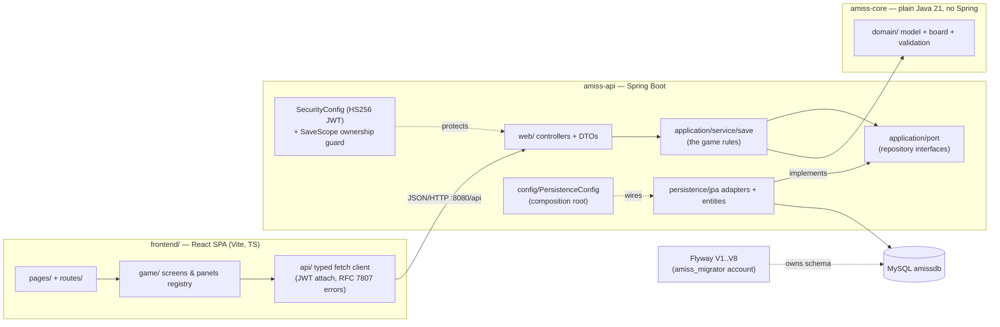

# AmissProj — Architecture

This document is the map of the codebase: a **React SPA** talking JSON/HTTP to a
**Spring Boot REST API**, which delegates every game rule to a **plain-Java core**
behind repository ports, persisting to **MySQL** through Spring Data JPA adapters
against a **Flyway-owned schema**. It covers the module layout, the layer
boundaries and the dependency rule, one request traced end-to-end, and the
persistence strategy — plus the gaps we know about.

A one-line history: the game began as a high-school Swing desktop app; the Swing
client was retired in July 2026 (KAN-51) once the web stack covered it, and the
saves/jobs/degrees milestone (KAN-52..54) reshaped the persistence model around
multiple saves per account. This doc describes what is in the tree **now**.

## The big picture



Arrows point in the direction of dependency. Everything converges on
`amiss-core`'s `domain` and `application` packages, and nothing in them points
back out — that is the dependency rule, and it is what let the JDBC→JPA swap
(KAN-34), the Swing deletion (KAN-51) and the KAN-54 port reshape happen without
touching a game rule.

## The layers

| Layer | Package / place | Responsibility | May depend on |
|-------|-----------------|----------------|---------------|
| **domain** | `amiss.domain.*` (core) | Entities, value types, the 13-stop board ring, pure input rules. No frameworks. | nothing (pure Java) |
| **application** | `amiss.application.*` (core) | The game rules (`service/save`) + **ports** (`port` — repository interfaces the rules own). | domain |
| **infrastructure** | `amiss.infrastructure.security` (core), `amiss.api.persistence.jpa` + `amiss.api.security` + `amiss.api.config` (api) | Adapters: JPA repositories, JWT/BCrypt, composition root. Implements the ports. | application, domain |
| **presentation** | `amiss.api.web.*` (api) + `frontend/` (over HTTP) | Delivery: REST controllers/DTOs; the SPA renders state and calls the API — **no game rules in JS**. | application, domain |

## The Maven reactor (plus the SPA)

| Module | Contains | Depends on |
|--------|----------|------------|
| `amiss-core` | `domain` + `application` + `infrastructure.security`; the Flyway migration sources (`src/main/resources/db/migration`); the rules' whole unit-test suite | SLF4J facade only |
| `amiss-api` | Spring Boot 3.5 REST API: controllers/DTOs, JWT security, JPA entities + port adapters, `PersistenceConfig` composition root; Testcontainers ITs | `amiss-core` |
| `amiss-coverage` | JaCoCo `report-aggregate` for CI; no code | the code modules |
| `frontend/` *(not Maven)* | Vite + React 19 + TypeScript SPA; built/tested by npm, wired into the same CI | the API over HTTP only |

Core exposes only the SLF4J facade; Spring Boot brings the logging backend, so
the modules can't fight over logging versions.

## Package tour

```
amiss-core/src/main/java/amiss/
  domain/
    model/        SaveState, UserGoals, JobSpec, JobListing, DegreeSpec,
                  FastFoodItem, FoodPack, ClothingItem     (entities / value types)
    board/        Board, Location                          (the 13-stop ring)
    validation/   Validation                               (pure input rules)
  application/
    port/         UserRepository, SaveRepository, JobCatalog, DegreeCatalog,
                  SaveDegrees, Turndowns                   (the seam — interfaces)
                  PersistenceFailureException              (technology-neutral)
    service/save/ SaveGameServices (facade) wiring BankService, RentService,
                  ShopService, TravelService, ShiftService, HiringService,
                  CourseService, GoalService, EconomyService,
                  WeekRolloverService, StatFormulas        (the game rules)
                  + typed outcomes: ShiftOutcome, HireOutcome, PurchaseOutcome,
                  EatOutcome, BankTransaction, RentPayment, MoveResult,
                  EconomyEvent
    config/       ActionCosts                              (time costs of actions)
  infrastructure/
    security/     PasswordHasher                           (BCrypt)

amiss-api/src/main/java/amiss/api/
  config/          PersistenceConfig (composition root), CostsConfig/-Properties
  security/        SecurityConfig (HS256 JWT), AuthService, AuthResult
  persistence/jpa/ SaveEntity, UserEntity, JobCatalogEntity, DegreeEntity,
                   SaveDegreeEntity, SaveTurndownEntity (+ id types)
                   → Spring Data repos → Jpa* adapters implementing the ports
  web/             AuthController (/api/auth), SaveController (/api/saves),
                   PlayerController, BankController, RentController,
                   EmploymentController, UniversityController, FoodController
                   (all /api/saves/{saveId}/...), BoardController (/api/board);
                   SaveScope (ownership guard), LocationGuard,
                   PlayerStateAssembler, GlobalExceptionHandler (RFC 7807)
  web/dto/         39 request/response records — the wire contract

frontend/src/
  api/             one typed module per surface (auth, saves, player, bank, rent,
                   jobs, university, food, clothes, board) over http.ts
                   (Bearer attach, RFC 7807 → ApiError, 401 → re-login)
  auth/            AuthContext, tokenStore (localStorage)
  game/            BoardScreen, Hud, EndWeekModal, NewGameSetup, WinBanner,
                   WorkAction; panels/ — a registry mapping each board stop to
                   its panel component (DefaultPanel as fallback)
  pages/, routes/  HomePage, LoginPage, SavesPage, PlayPage; RequireAuth
```

Tests mirror these packages (`amiss-core/src/test`, `amiss-api/src/test` — unit
suites plus MySQL Testcontainers `*IT` classes; `frontend/src` co-locates
Vitest/RTL tests next to sources).

## One request, end to end

`POST /api/saves/42/work` — the player works a shift:

1. **Security filter chain** (`SecurityConfig`): every `/api/**` route except
   register/login/health requires a Bearer JWT; the HS256 token is verified and
   its subject becomes the `Authentication`.
2. **Controller** (`EmploymentController.work`): calls
   `SaveScope.require(42, authentication)` — loads the save and proves the JWT
   subject owns it (403 on someone else's save, 404 if absent). It then checks
   the standing-at-the-workplace guard against the `JobCatalog` port.
3. **Rules** (`ShiftService.work(save)` in `amiss-core`): decides the outcome —
   pay from the save's snapshotted wage, time charged, warnings/fired states —
   mutating `SaveState` and writing it back through the **`SaveRepository`
   port**. The service knows only the interface.
4. **Adapter** (`JpaSaveRepository` behind the port, chosen in
   `PersistenceConfig`): translates to Spring Data / Hibernate against
   `SaveEntity`, hits MySQL, and converts any `DataAccessException` into the
   port's `PersistenceFailureException` at the boundary.
5. **Response**: the typed `ShiftOutcome` maps to HTTP — rejection statuses
   become RFC 7807 problem responses via `GlobalExceptionHandler`; success
   returns a `WorkResponse` DTO with the fresh player state.
6. **SPA**: the `WorkAction` mutation updates the `['save', 42]` React Query
   cache from the response (and invalidates on rejection — the server may have
   charged time even when refusing).

The dependency rule in one sentence: the controller and the adapter both point
at the core; the core points at nothing.

## Persistence strategy

- **Flyway owns the schema.** Versioned SQL lives in
  `amiss-core/src/main/resources/db/migration` (V1 baseline schema, V2 seed
  data, V3 time-to-minutes, V4 bank, V5 saves/jobs/degrees, V6 drop legacy
  state, V7 economy state, V8 wage snapshot), applied automatically at API
  startup. Hibernate runs `ddl-auto=validate` — JPA maps the schema, it never
  creates or alters it.
- **Expand/contract migrations.** V5→V6 is the worked example: V5 *expanded*
  (new `tblsave`, `tbljob_catalog`, `tbldegree` tables, data copied from the
  legacy shape) while both shapes stayed live; V6 *contracted* (dropped
  `tbluserstats`, `tbljobs`, and `tbluser`'s state columns) only after the code
  cutover shipped. A deployed migration is never edited — Flyway checksums it.
- **Least-privilege accounts.** The runtime `amiss` user has DML rights only;
  DDL belongs to the dedicated `amiss_migrator` account Flyway runs as
  (`db/bootstrap.sql` creates both).
- **Testcontainers proves it.** The `*IT` suite boots a disposable MySQL 9
  container and runs the full V1→V8 chain, including a legacy-user survival
  test across the V5/V6 cutover.

## The load-bearing seam: repository ports

Each persistence concern is split in two: an **interface** in
`amiss.application.port` (what the rules need) and an **adapter** in
`amiss.api.persistence.jpa` (how it's satisfied), married in one place —
`PersistenceConfig`, the composition root. Services are built by the
`SaveGameServices` facade from the ports they're given and never construct
repositories themselves; no persistence type reaches the web layer.

Ports throw the technology-neutral, unchecked `PersistenceFailureException`;
the adapter layer alone catches the technology's exceptions (Spring's
`DataAccessException` family) and translates at the boundary (KAN-17).

Why it's load-bearing — proven three times: the JDBC→Spring-Data swap (KAN-34)
touched adapters and the composition root only; deleting the entire Swing/JDBC
side (KAN-51) touched no rule code; and the KAN-54 reshape retired three legacy
ports and added the save-scoped ones with the rules' tests as the safety net.

## Known gaps (honest list)

- **No optimistic locking on saves.** `SaveEntity` has no `@Version`; the
  save-scoped services do read-modify-write, so a player double-submitting
  against their own save can race (e.g. overdraft) — no cross-account exposure
  (SaveScope), but it's the known concurrency hole (2026-07-12 audit; chore
  ticket planned ahead of KAN-49).
- **No API versioning.** The wire contract is pinned by tests, not by a
  versioned path or media type; a breaking change means coordinating the SPA
  in the same release (as KAN-54/KAN-45 did, deliberately back-to-back).

## Related docs

- [README.md](../README.md) — quick start, tech stack, project structure
- [GAMEPLAY.md](GAMEPLAY.md) — player-facing rules incl. the economy odds
- [SETUP.md](../SETUP.md) — full environment setup & troubleshooting
- [ROADMAP.md](../ROADMAP.md) — the phased plan this grew along
